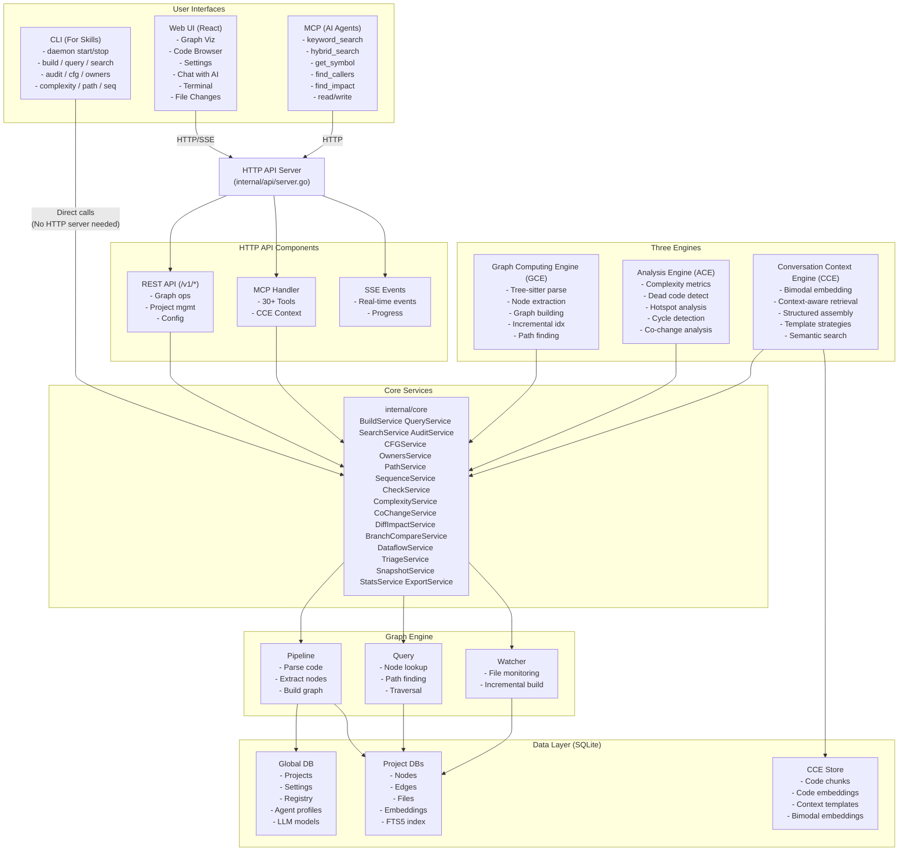
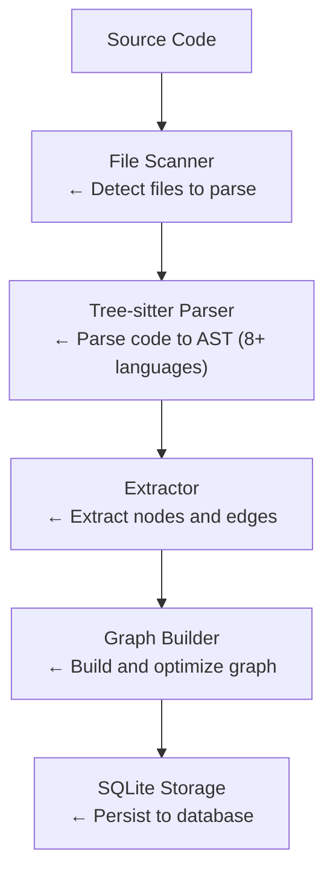
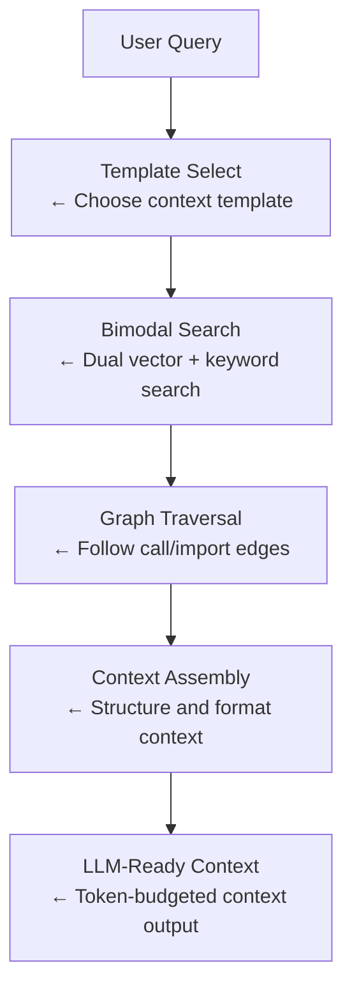
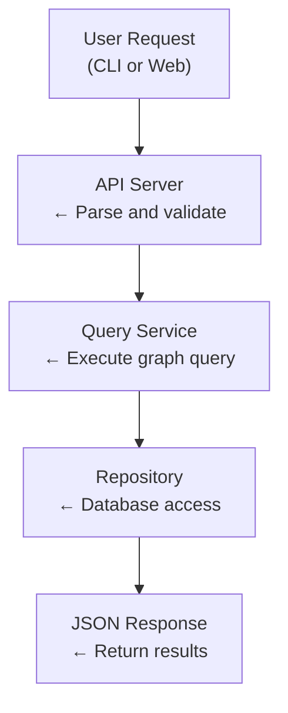

# Architecture Overview

This document provides an overview of the Axons architecture, its components, and how they interact.

## High-Level Architecture

Axons drives multi-agent collaboration through three engines (Graph Computing Engine, Analysis Engine, Conversation Context Engine), providing full-chain capabilities from code understanding to intelligent repair.

Three main user interfaces:
- **CLI** - Command-line interface that directly calls core services
- **Web UI** - Browser-based interface that communicates via HTTP/WebSocket
- **MCP** - Model Context Protocol interface exposed via HTTP Handler for AI agents



### Key Architecture Points

1. **CLI → Core Services (Direct)**: CLI commands directly instantiate and call core services without requiring a running HTTP server. This provides the fastest access for local operations.

2. **Web UI → HTTP API**: The web interface requires a running HTTP server (`daemon start --tcp :8080`) and communicates via HTTP/SSE for graph visualization, code browsing, AI chat, terminal access, and settings management.

3. **MCP → HTTP Handler**: AI agents connect via MCP (Model Context Protocol) through HTTP Handler, requiring a running HTTP server. This enables programmatic access to graph operations, code search, analysis tools, and file operations for AI assistants.

4. **Shared Core Logic**: All three interfaces (CLI, Web UI, MCP) use the same core services (`internal/core`), ensuring consistent behavior regardless of the access method.

5. **Three-Engine Architecture**: GCE handles code parsing and graph building, ACE provides static and dynamic analysis, and CCE delivers context-aware code understanding through bimodal embedding and retrieval.

## Core Components

### 1. CLI Layer (`cmd/axons/cmd`)

The command-line interface built with Cobra. Most commands **directly call core services** without requiring a running daemon:

**Direct Execution Commands (no daemon needed):**
- `build` - Build code graph (calls `core.BuildService`)
- `query` - Query nodes (calls `core.QueryService`)
- `search` - Search code (calls `core.SearchService`)
- `audit` - Code quality audit (calls `core.AuditService`)
- `cfg` - Control flow graph (calls `core.CFGService`)
- `owners` - Code ownership (calls `core.OwnersService`)
- `export` - Export graph data
- `stats` - Get statistics
- `complexity` - Analyze code complexity
- `path` - Find paths between symbols
- `sequence` - Generate call sequences
- `cochange` - Identify co-changing files
- `dataflow` - Analyze data flow
- `diff-impact` - Analyze diff impact
- `branch-compare` - Compare branches
- `snapshot` - Create and manage snapshots
- `triage` - Triage issues
- `check` - Check code health
- `embed` - Generate embeddings
- `registry` - Manage multiple projects

**Daemon Management Commands:**
- `daemon start` - Start the background service (with `--tcp` for Web UI)
- `daemon stop` - Stop the daemon
- `daemon ps` - Check daemon status

**Note**: Some commands like `watch start/stop` require a running daemon and communicate via Unix socket.

### 2. UI (`ui/`)

A React-based web interface providing:

- **Graph Visualization** - Interactive code graph using Sigma.js with graphology
- **Code Browser** - Browse and search code with syntax highlighting
- **Settings Panel** - Configure embedding providers, LLM, etc.
- **Chat with AI** - AI-powered code assistant with streaming
- **Terminal** - Built-in terminal with xterm.js
- **Project Management** - Manage multiple projects
- **File Changes** - Track and manage AI file modifications

Built with:
- React 19 + TypeScript
- Sigma.js + graphology for graph visualization
- xterm.js for terminal
- Tailwind CSS for styling
- Vite for bundling

### 3. Core Services (`internal/core`)

The core business logic layer shared by both CLI and HTTP handlers:

| Service | Description |
|---------|-------------|
| `BuildService` | Build code graph from source |
| `QueryService` | Query nodes and relationships |
| `SearchService` | Search code (keyword/semantic/hybrid) |
| `AuditService` | Code quality audit |
| `CFGService` | Control flow graph analysis |
| `OwnersService` | Code ownership analysis |
| `EmbedService` | Embedding generation |
| `PathService` | Path finding between nodes |
| `SequenceService` | Call sequence analysis |
| `CheckService` | Code health checking |
| `ComplexityService` | Code complexity metrics |
| `CoChangeService` | Co-change analysis |
| `DiffImpactService` | Diff impact analysis |
| `BranchCompareService` | Branch comparison |
| `DataflowService` | Data flow analysis |
| `TriageService` | Issue triage |
| `SnapshotService` | Code snapshots |
| `StatsService` | Project statistics |
| `ExportService` | Graph data export |

**Usage Pattern:**
```go
// CLI directly calls core service
repo, _ := openLocalRepo()
svc := core.NewBuildService(repo)
result, _ := svc.Build(ctx, &core.BuildOptions{...})

// HTTP handler also calls the same core service
// (or directly uses graph.Pipeline for async execution)
pipeline := graph.NewPipeline(repo, opts)
result, _ := pipeline.Build(ctx)
```

### 4. HTTP API Server (`internal/api`)

The HTTP server that handles Web UI and MCP requests. HTTP handlers either:
1. Call core services (for synchronous operations)
2. Directly use the graph engine (for async operations like build)

**REST API Endpoints:**
- `/v1/build` - Build graph
- `/v1/query` - Query nodes
- `/v1/search` - Search code
- `/v1/stats` - Get statistics
- `/v1/symbols/:id` - Symbol operations
- `/v1/embed` - Embedding operations
- `/v1/audit`, `/v1/check`, `/v1/complexity` - Analysis
- `/v1/cce/*` - CCE (Code Context Engine) operations
- `/v1/graph/*` - Graph algorithm operations (metrics, communities, pagerank, cycles)
- `/v1/analysis/*` - Analysis operations (hotspots, deadcode, cochange)
- `/v1/arch/*` - Architecture rules engine
- `/v1/processes/*` - Process execution flows
- `/v1/projects/*` - Project management
- `/v1/repos/*` - Registry management
- `/v1/tasks` - Task management
- `/v1/settings` - Settings management
- `/v1/watch/*` - Watch operations

**SSE Events:**
- `/v1/events` - Real-time event stream for build progress and embedding updates

**MCP Handler:**
The MCP (Model Context Protocol) interface exposed via HTTP Handler for AI agents:
- **Protocol**: JSON-RPC 2.0 over HTTP
- **Endpoint**: `POST /mcp`
- **30+ Tools** organized in categories:
  - **Search**: `keyword_search`, `hybrid_search`, `semantic_search`, `rerank_results`, `search_symbols`
  - **Graph**: `get_symbol`, `find_callers`, `find_callees`, `path`
  - **Analysis**: `list_files`, `get_stats`, `find_dead_code`, `find_hotspots`, `find_impact`, `find_call_chain`, `get_complexity`, `get_cochanges`, `get_pagerank`, `arch_check`, `list_communities`, `get_modules`, `get_node_by_file`, `list_processes`, `get_process`
  - **Source**: `get_source_code`, `embedding_status`, `read_file`, `smart_read`, `write_file`, `run_command`
  - **CCE**: `get_context`, `list_context_templates`

**Web UI Compatibility Routes** (`/api/*`):
- Graph visualization data
- File operations (read/write/delete)
- Search and impact analysis
- Chat and agent APIs
- Terminal sessions
- File change tracking
- LLM model management

### 5. Graph Engine (`internal/graph`)

Core graph processing:

**Pipeline** - Code to graph transformation:
```
Source Files → Tree-sitter Parser → Extractor → Builder → Graph (SQLite)
```

**Query Service** - Graph queries:
- Node lookup by name, ID, file
- Relationship traversal (callers, callees)
- Path finding (BFS shortest path)

**Watcher** - Real-time file monitoring:
- Detects file changes
- Incremental graph updates
- Journal-based change tracking

### 6. Conversation Context Engine (CCE) (`internal/cce`)

The CCE provides intelligent code context for LLM conversations:

**Components:**
- **Engine** - Main orchestrator for CCE operations
- **BimodalEmbedder** - Generates both description and code embeddings (dual-mode)
- **ContextRetriever** - Context-aware retrieval combining semantic search and graph traversal
- **ContextAssembler** - Assembles structured context from multiple sources
- **Store** - SQLite storage for code chunks, embeddings, and templates

**Embedding Modes:**
- `description` - Metadata text only (legacy)
- `code` - Source code snippets only
- `dual` - Both description and code (bimodal, recommended)

**Context Templates:**
- `understand_function` - Context for understanding a function
- `change_impact` - Context for assessing change impact
- `debug_trace` - Context for debugging/tracing issues
- `explore_module` - Context for exploring a module
- `general` - General-purpose context collection

### 7. Agent Service (`internal/agent`)

AI agent for code understanding with multi-agent orchestration:

**ReAct Agent** - Reasoning and Acting agent:
- Uses LLM for reasoning
- Executes MCP tools
- Maintains conversation memory
- Anti-loop detection and termination conditions

**5 Built-in Agent Profiles:**
| Profile | ID | Description |
|---------|------|-------------|
| AI Assistant | `default` | Orchestrator: decomposes tasks and delegates to sub-agents |
| Architect | `architect` | Module boundaries, dependency analysis, architecture compliance |
| Code Quality Analyst | `quality` | Complexity, dead code, hotspots, coupling detection |
| Impact Analyst | `impact` | Change impact scope, call chains, blast radius assessment |
| Code Engineer | `engineer` | Read/write files, execute commands, complete coding tasks |

**Multi-Agent Orchestration:**
- Master orchestrator delegates tasks to specialized sub-agents
- `delegate_to_agent` tool for inter-agent communication
- Custom agent profiles supported via API

**LLM Clients:**
- OpenAI (GPT-4, etc.)
- Anthropic (Claude)
- Ollama (local models)
- Custom endpoints

**Memory:**
- SQLite-based conversation storage
- Context management with session persistence

### 8. Terminal Service (`internal/terminal`)

Built-in terminal for AI agent and web UI:

**Features:**
- PTY-based terminal sessions
- WebSocket communication for real-time I/O
- Session management (create, kill, resize, list)
- Ring buffer for scrollback
- Cross-platform support (Unix and Windows)

**API Endpoints:**
- `POST /api/terminal/sessions` - Create session
- `GET /api/terminal/sessions/:id/ws` - WebSocket connection
- `DELETE /api/terminal/sessions/:id` - Kill session
- `POST /api/terminal/sessions/:id/resize` - Resize terminal

### 9. Embedding Service (`internal/service`)

Semantic search capabilities:

**Search Service** - Multi-mode search:
- FTS5 BM25 keyword search
- Semantic vector similarity search
- Hybrid search (FTS5 + vector + RRF fusion)
- Reranking support (Cohere, Jina, mock)

**Embedding Providers:**
- OpenAI (`text-embedding-3-small/large`)
- Ollama (`nomic-embed-text`, etc.)
- Jina AI
- Custom endpoints

**Features:**
- Incremental embedding updates
- Vector similarity search
- Multi-provider support

### 10. Database Layer (`internal/db`)

SQLite-based storage:

**Global Database:**
- Projects
- Settings
- Registry
- Agent profiles
- LLM models

**Project Databases:**
- Nodes (functions, methods, classes, etc.)
- Edges (relationships)
- Files
- Embeddings
- FTS5 full-text search index

**CCE Store:**
- Code chunks
- Code embeddings
- Bimodal embeddings
- Context templates

### 11. File Change Tracking

AI file modification tracking system:

**Features:**
- Track all AI file modifications
- View diffs of changes
- Revert individual or all changes
- Integration with the Agent system for safe code modifications

## Data Flow

### Building the Graph



### Context Retrieval (CCE)



### Querying the Graph



## Node and Edge Types

### Node Types

| Type | Description |
|------|-------------|
| `function` | Functions |
| `method` | Methods (receiver functions) |
| `class` | Classes and structs |
| `interface` | Interfaces |
| `variable` | Variables and constants |
| `import` | Import statements |
| `file` | Source files |

### Edge Types

| Type | Description |
|------|-------------|
| `CALLS` | Function call relationship |
| `IMPORTS` | Import relationship |
| `IMPLEMENTS` | Interface implementation |
| `EXTENDS` | Inheritance relationship |
| `CONTAINS` | Containment relationship |
| `REFERENCES` | Reference relationship |
| `DATAFLOW` | Data flow relationship |

## Supported Languages

The code graph engine supports the following languages via tree-sitter extractors:

| Language | Extractor | Status |
|----------|-----------|--------|
| Go | `internal/extractors/go.go` | Production-ready |
| TypeScript | `internal/extractors/typescript.go` | Production-ready |
| JavaScript | `internal/extractors/javascript.go` | Production-ready |
| Python | `internal/extractors/python.go` | Supported |
| Java | `internal/extractors/java.go` | Supported |
| Rust | `internal/extractors/rust.go` | Supported |
| C/C++ | `internal/extractors/c_cpp.go` | Supported |
| C# | `internal/extractors/csharp.go` | Supported |

## Extension Points

### Adding a New Language Parser

1. Create extractor in `internal/extractors/<language>.go`
2. Implement the extraction interface
3. Register in `internal/extractors/registry.go`
4. Add test data and unit tests

### Adding a New LLM Provider

1. Create client in `internal/agent/llm/<provider>.go`
2. Implement the `Client` interface
3. Register in agent initialization

### Adding a New Embedding Provider

1. Create embedder in `pkg/clients/embedding/`
2. Implement the `Embedder` interface
3. Register in settings/config

### Adding a New MCP Tool

1. Define argument type in `internal/mcp/tools_types.go`
2. Implement handler in `internal/mcp/mcp_server.go` or new file
3. Register tool in `registerTools()` method
4. Add tool to relevant agent profiles in `internal/agent/profiles.go`

## Deployment Modes

### Local Development
```bash
# Start daemon with Web UI
axons daemon start --tcp :8080

# Access Web UI
open http://localhost:8080
```

### CLI-Only
```bash
# Build graph
axons build /path/to/code

# Query
axons query main
```

### Production
- Docker container with embedded frontend
- Kubernetes deployment
- Systemd service

## Performance Considerations

- **Incremental Indexing** - Only process changed files
- **Project Databases** - Isolated storage per project
- **Embedding Cache** - Reuse embeddings until code changes
- **Lazy Loading** - Load project DBs on demand
- **FTS5 Index** - Fast full-text search with BM25 ranking
- **Bimodal Embedding** - Dual description + code vectors for better semantic matching
- **Task Management** - Async operation tracking with cancellation support

## Security Considerations

- **Path Validation** - Prevent directory traversal
- **Input Sanitization** - All inputs validated
- **API Keys** - Stored in database, not env vars
- **Local Only** - Default binding to localhost
- **Terminal Security** - Command allowlist for `run_command` MCP tool
- **File Write Scope** - MCP `write_file` restricted to project root
- **Change Tracking** - All AI file modifications tracked and reversible