# Axons User Manual

This document is the complete user manual for the Axons code intelligence engine, covering instruction for core functional modules such as project management, graph analysis, code panel, AI panel, terminal, etc.

---

## Table of Contents

- [Project](#project)
  - [Create Project](#create-project)
  - [Import Project](#import-project)
- [Settings](#settings)
  - [System Settings](#system-settings)
  - [Project Settings](#project-settings)
- [Graph Panel](#graph-panel)
  - [Graph Zoom](#graph-zoom)
  - [Node Operations](#node-operations)
- [Code Panel](#code-panel)
- [Analysis Panel](#analysis-panel)
  - [Code Health](#code-health)
  - [Graph Analysis](#graph-analysis)
  - [Impact Analysis](#impact-analysis)
  - [Control Flow Graph](#control-flow-graph)
  - [Sequence Diagram](#sequence-diagram)
  - [Architecture Rules](#architecture-rules)
  - [Execution Flow](#execution-flow)
- [AI Panel](#ai-panel)
  - [Agent Management](#agent-management)
  - [Conversation History and Session Management](#conversation-history-and-session-management)
  - [Models](#models)
- [Terminal](#terminal)
  - [General Functions](#general-functions)
  - [Multiple Windows](#multiple-windows)

---

## Project

### Create Project

Through the "Create Project" feature, you can create a new blank project in Axons and configure the basic information of the project.

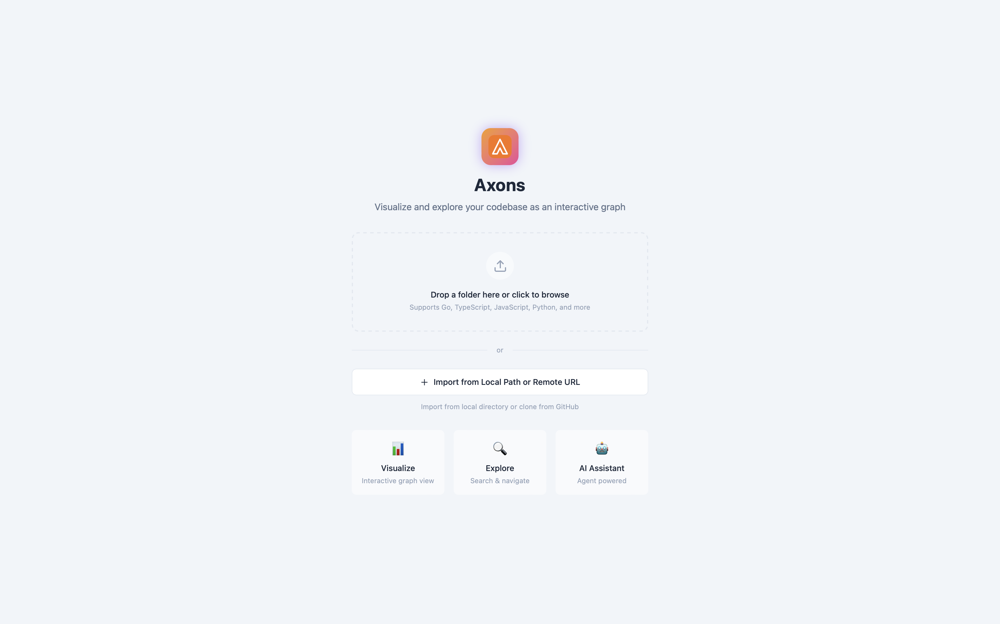

> When opening Axons for the first time, you will see the welcome interface shown above. The center of the page provides an entry for "Import local path or remote URL", supporting drag-and-drop of folders or click-to-browse for quick project import. The bottom of the interface showcases Axons' three core capabilities: visual interactive graph, code search navigation, and AI agents.

**Operation Steps:**

1. Click the "Project" entry in the left navigation bar.
2. Click the "Create Project" button.
3. Fill in basic information such as project name and description in the pop-up dialog.
4. Select the storage path for the project.
5. Click "Confirm" to complete creation.

After creation, the system will automatically jump to the working space of the new project and begin initializing the code graph.

---

### Import Project

Through the "Import Project" feature, you can import existing local code repositories into Axons for analysis. Axons supports two import methods: local path and remote URL.

#### Import from Local Path

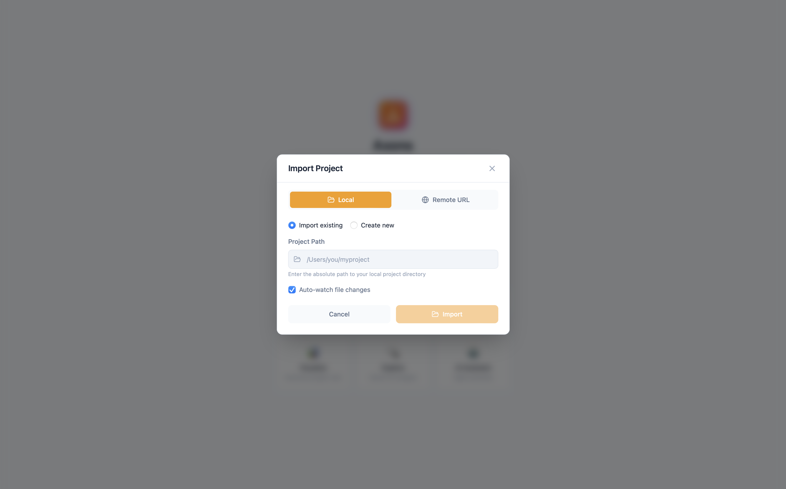

> After selecting the "Local" tab, fill in the absolute path of the local project directory in the "Project Path" input box (e.g., `/users/you/myproject`). Checking "Auto-watch file changes" allows Axons to automatically update the graph when code files change. After filling in, click "Import" to start the import.

**Operation Steps:**

1. Click the "Project" entry in the left navigation bar.
2. Click the "Import Project" button, and the import dialog will pop up.
3. Select the "Local" tab.
4. Fill in the absolute path of the local repository in "Project Path".
5. Check "Auto-watch file changes" as needed.
6. Click "Import" to start building the graph.

#### Import from Remote URL

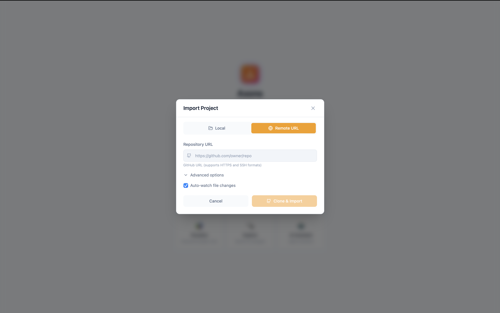

> After selecting the "Remote URL" tab, fill in the GitHub repository address in "Repository URL" (supports both HTTPS and SSH formats). Axons will automatically clone the repository locally and analyze it.

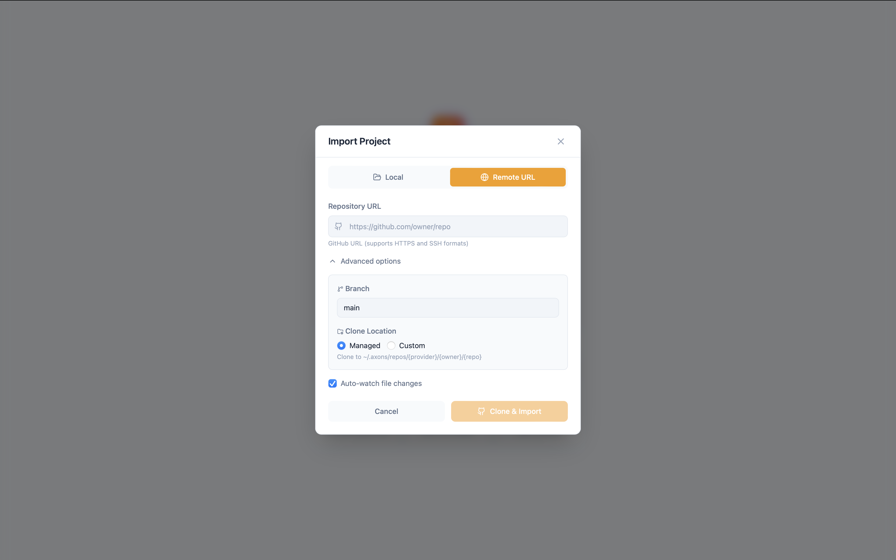

> After expanding "Advanced options", you can specify the branch to clone (default is `main`) and the clone location. When selecting "Managed", Axons will clone the repository to the unified management directory `~/.axons/repos/`; selecting "Custom" allows you to customize the local path. After configuration, click "Clone & Import".

**Operation Steps:**

1. Select the "Remote URL" tab.
2. Fill in the GitHub repository address (supports both HTTPS and SSH formats).
3. Expand "Advanced options" as needed to configure branch and clone path.
4. Check "Auto-watch file changes" (optional).
5. Click "Clone & Import" and wait for cloning and graph building to complete.

During the import process, the system will automatically parse the code structure and build the dependency relationship graph. After completion, you can view the full picture in the graph panel.

---

## Settings

### System Settings

System settings provide global-level configuration options that take effect for all projects.

#### Theme Settings

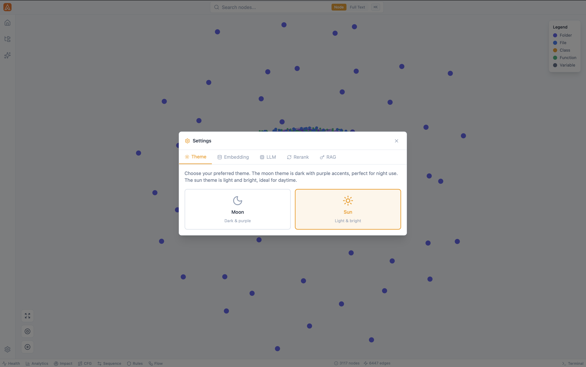

> In the "Theme" tab, you can switch between the dark "Moon" theme (dark background with purple accent color, suitable for night use) and the light "Sun" theme (bright style, suitable for daytime use). Click on the corresponding theme card to preview and apply in real-time.

#### Embedding Settings

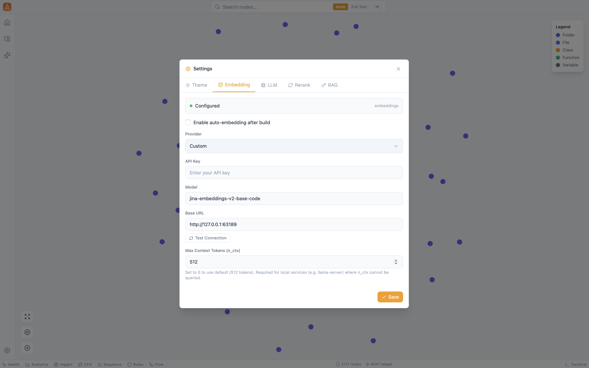

> In the "Embedding" tab, you can configure vector embedding models to support code semantic search functionality. After checking "Enable auto-embedding after build", embedding vectors will be automatically generated each time the graph build is completed. You can select Provider (e.g., Custom) and fill in API Key, model name, and Base URL.

#### LLM Model Settings

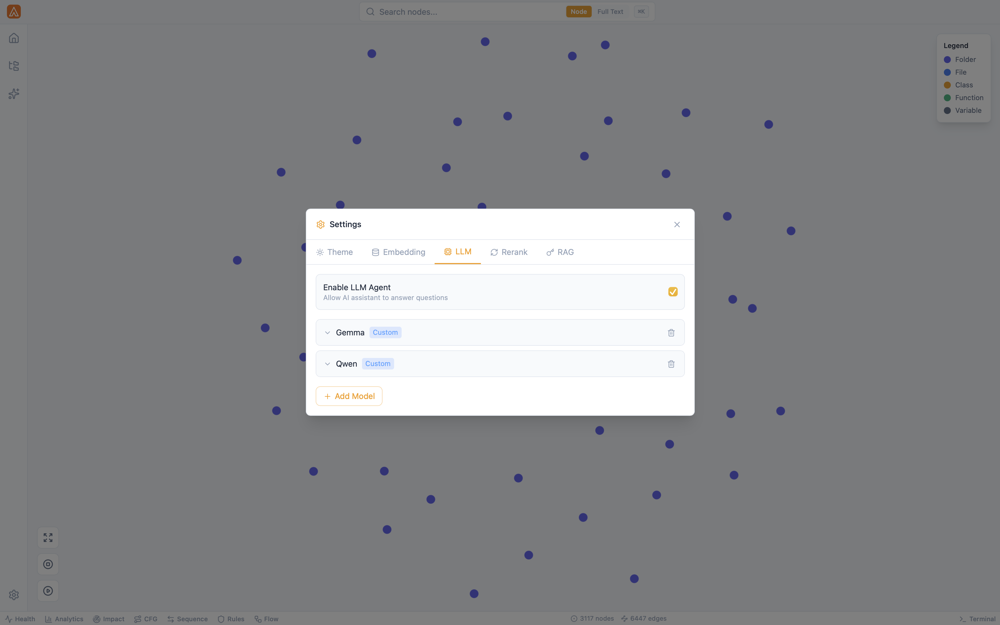

> In the "LLM" tab, you can manage the large language models used by the AI panel. After checking "Enable LLM Agent", AI agents will be able to answer code-related questions. The list shows configured models (e.g., Gemma, Qwen and other custom models), click "+ Add Model" to add new models.

#### Rerank Settings

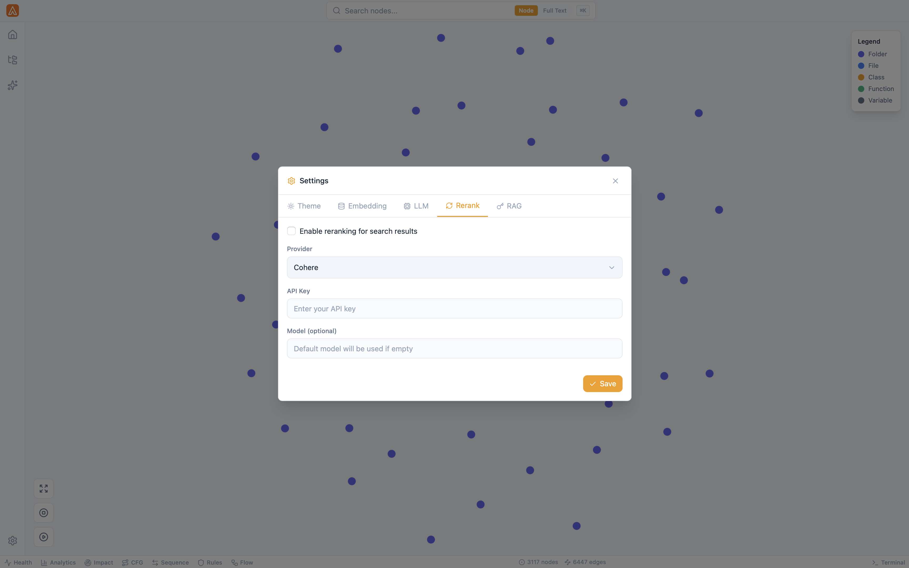

> In the "Rerank" tab, you can enable search result reranking functionality to improve semantic search accuracy. After checking "Enable reranking for search results", select Provider (e.g., Cohere) and fill in API Key to enable reranking.

#### RAG Settings

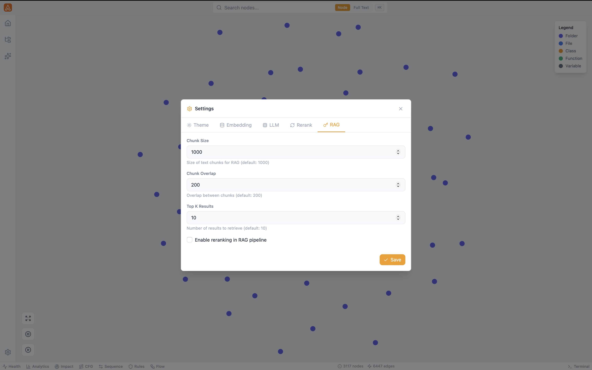

> In the "RAG" tab, you can configure parameters for the Retrieval-Augmented Generation (RAG) pipeline. Main parameters include: Chunk size (text chunk size, default 1000), Chunk overlap (chunk overlap amount, default 200), and Top K Results (number of retrieval results returned, default 10). Checking "Enable reranking in RAG pipeline" enables secondary sorting of RAG results to improve answer quality.

**Configurable items include:**

| Configuration Item | Description |
|-------------------|-------------|
| Theme | Switch interface light/dark theme |
| Language | Set interface display language |
| Embedding | Configure vector embedding models |
| LLM | Manage large language models |
| Rerank | Configure search reranking |
| RAG | Configure retrieval-augmented generation parameters |

**Operation Entry:** Click the "Settings" icon in the top menu bar or sidebar, then select "System Settings".

---

### Project Settings

Project settings only take effect for the current project, allowing differentiated configuration for different projects.

**Configurable items include:**

| Configuration Item | Description |
|-------------------|-------------|
| Project Name | Modify the display name of the project |
| Root Directory | Adjust the root path for project scanning |
| Ignore Rules | Configure files or directories not to participate in analysis (supports glob syntax) |
| Analysis Language | Specify the primary programming language of the project |
| Graph Refresh Strategy | Set when the graph automatically rebuilds after code changes |
| Architecture Rules | Bind architecture rule sets applicable to the current project |

**Operation Entry:** Within the project workspace, click "Settings" → "Project Settings".

---

## Graph Panel

The graph panel is the core visualization area of Axons, displaying the dependency relationships between modules, files, and functions in the code in the form of nodes and edges.

### Graph Zoom

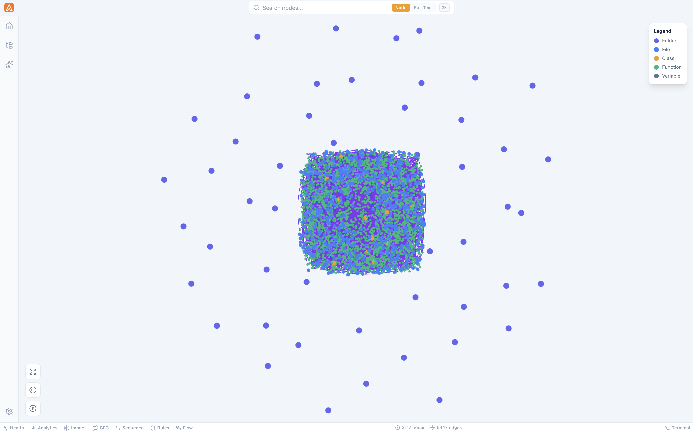

> The above image shows the completed code graph global view. In the graph, each circular node represents a code element (folder, file, function, or variable), and the lines between nodes indicate dependency or calling relationships. The top right corner displays the current graph node count (3117 nodes) and edge count (6447 edges). The bottom toolbar provides entry points for analysis functions such as Health (code health), Analytics (graph analysis), Impact (impact analysis), CFG (control flow graph), Sequence (sequence diagram), Rules (architecture rules), and Flow (execution flow).

The graph panel supports multiple zoom methods, facilitating switching between global view and local details.

**Zoom Operations:**

| Operation | Description |
|-----------|-------------|
| Mouse wheel up/down | Zoom in/out of the graph |
| Trackpad two-finger pinch | Zoom the graph |
| `Ctrl + +` / `Ctrl + -` | Keyboard shortcuts to zoom in/out |
| `Ctrl + 0` | Reset zoom ratio to default |
| Toolbar zoom buttons | Click `+` / `-` buttons in the graph panel toolbar |
| "Fit to Window" button | One-click zoom the graph to fully display in the current viewport |

---

### Node Operations

Each node in the graph represents a code element (module, file, class, function, etc.) and supports multiple interaction operations.

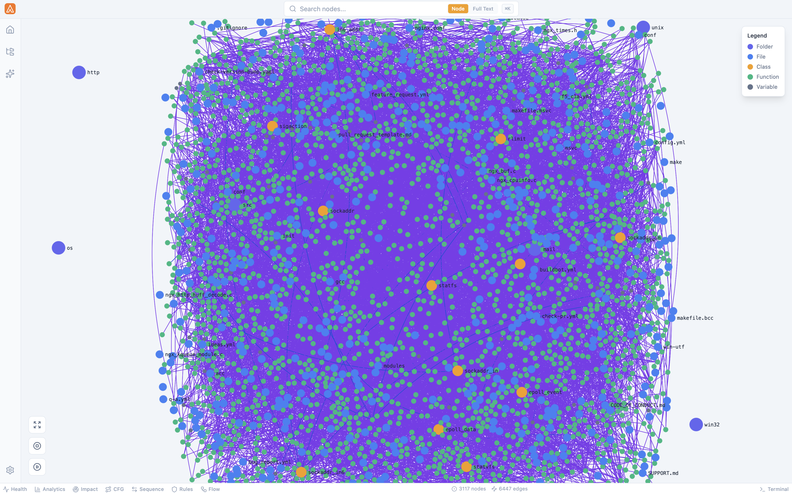

> After zooming in on the graph, you can clearly see the legend for nodes: different colors and shapes distinguish different types of code elements such as Folder (folder), File (file), Class (class), Function (function), Variable (variable), etc. The direction of the lines between nodes indicates the direction of dependencies.

#### File Tree View

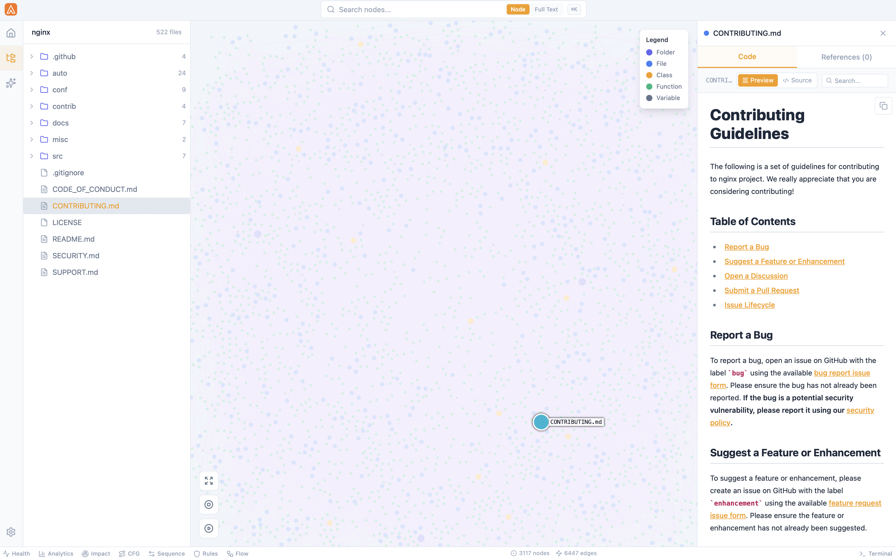

> In the left search panel, you can browse the entire project structure in file tree form. Supports "Node" (node) and "Full Text" (full text) search modes. Clicking on tree nodes can locate the corresponding position in the graph, and expanding folders allows viewing sub-files.

#### Expand Node Dependencies

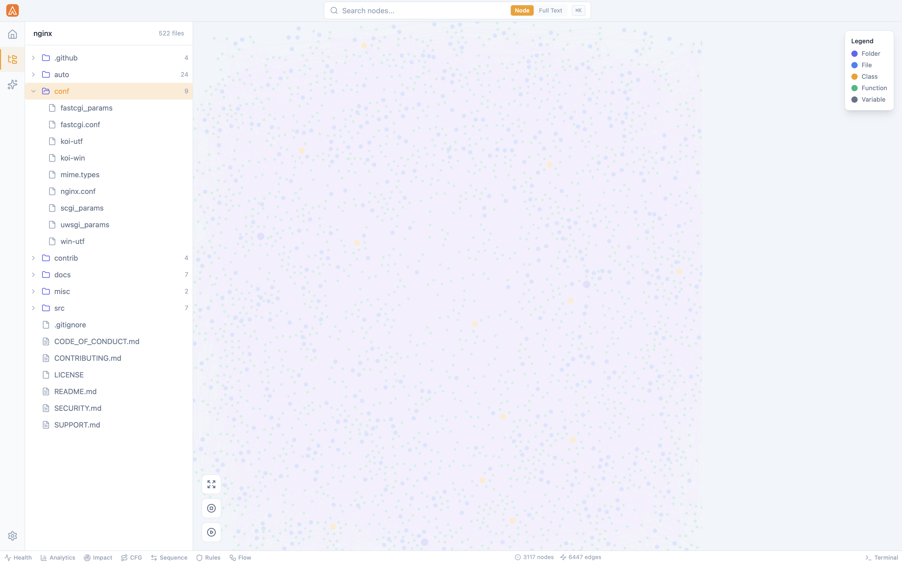

> Double-clicking on a directory node in the graph allows you to expand and view its internal files and subdirectories. The above image shows after expanding the `conf` directory, all configuration files within it (e.g., `nginx.conf`, `mime.types`, etc.) are presented in the graph as independent nodes, facilitating detailed analysis of the module's dependency relationships.

**Basic Operations:**

| Operation | Description |
|-----------|-------------|
| Click node | Select the node, and the right panel displays details |
| Double-click node | Expand/collapse the node's child dependencies |
| Right-click node | Pop up context menu with more operation options |
| Drag node | Adjust the node's position in the graph |
| Hover node | Display brief information tooltip for the node |

**Context Menu Options:**

- **Open in Code Panel** — Jump to the source code location corresponding to the node
- **View Impact Analysis** — Analyze the impact scope of changes to the node across the entire project
- **View Control Flow Graph** — Display the control flow structure of the function
- **View Sequence Diagram** — Display the calling sequence of the function
- **Pin/Unpin** — Lock the node in the current position to prevent movement during graph re-layout
- **Hide Node** — Hide the node from the current view

---

## Code Panel

The code panel provides source code viewing and browsing functionality, linked with the graph panel, facilitating quick switching between visual views and code details.

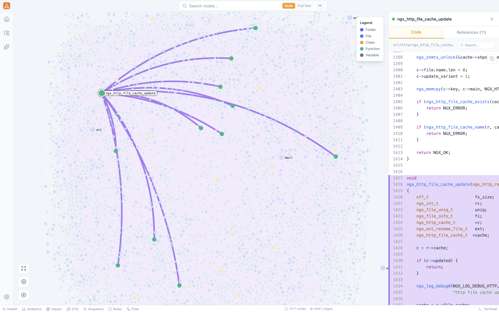

> The above image shows the main functions of the code panel. After clicking on the `ngx_http_file_cache_update` function node in the graph, the code panel on the right automatically opens the "References (reference)" panel, displaying 11 reference locations of the function in the project, each marked with file path and line number. The left code area highlights the source code content of the function, supporting syntax highlighting for quick understanding of code logic.

**Main Functions:**

- **Code Highlighting** — Supports syntax highlighting for multiple programming languages
- **Graph Linkage** — After selecting a node in the graph, the code panel automatically locates and highlights the corresponding code snippet
- **Jump to Definition** — Click on symbols in the code to jump to their definition location (supports cross-file jumping)
- **Find References** — Right-click on a symbol and select "Find All References" to display all usage locations of the symbol in the project
- **Breadcrumb Navigation** — The top of the code panel displays the path hierarchy of the current file, supporting quick jumping to parent directories
- **Code Folding** — Supports folding of function bodies and code blocks for viewing overall structure
- **Mini Map** — Provides a code thumbnail on the right side of the panel for quick location of code position

---

## Analysis Panel

The analysis panel integrates various code analysis capabilities to help developers deeply understand code quality and structure.

### Code Health

The code health function performs comprehensive quality scanning on the project and generates visual health reports.

> Click the "Health" tab in the bottom toolbar of the graph panel to enter the code health analysis panel. The file tree area on the left side of the graph simultaneously displays the overall project structure (522 files), and the bottom shows switchable analysis dimensions.

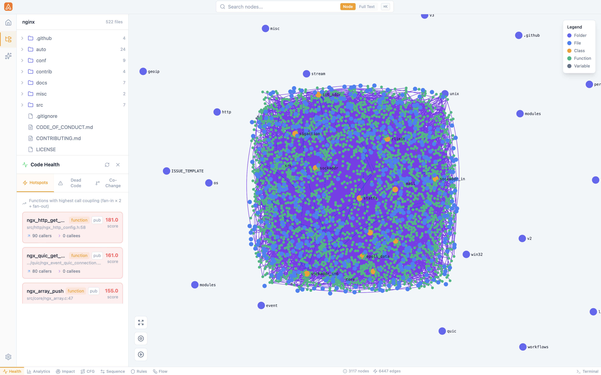

> After code health analysis is completed, the panel will display a "Hotspots" report. The hotspots view visually marks areas in the project with high complexity, frequent modifications, or severe coupling, helping developers quickly locate modules that need focused attention.

**Reports include the following dimensions:**

- **Complexity** — Function cyclomatic complexity statistics, identifying high-complexity functions
- **Duplicate Code** — Detect similar or duplicate code snippets in the project
- **Code Coupling** — Analyze the coupling degree between modules, identifying high-coupling areas
- **Comment Coverage** — Statistics on the proportion of comments in core modules
- **Test Coverage** — Display code coverage combined with test reports (requires configuration of test result path)

**Operation Steps:**

1. Open the "Analysis Panel" and switch to the "Code Health" tab.
2. Click "Start Analysis" and wait for scanning to complete.
3. View scores and problem lists for each dimension.
4. Click on specific problem items to jump to the code panel to locate corresponding code.

---

### Graph Analysis

Graph analysis functions provide deep insights at the structural level based on the code graph.

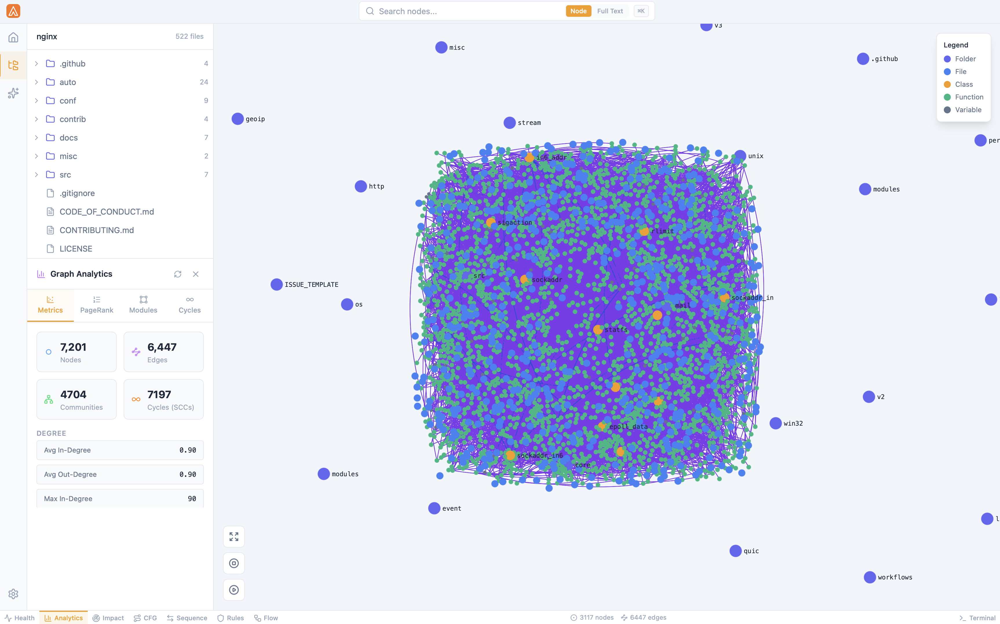

> Click "Analytics" in the bottom toolbar to enter the graph analysis panel. The above image shows the PageRank analysis results — the system calculated PageRank scores for 7,201 nodes in the graph. Higher scores indicate higher dependency degrees from other nodes (i.e., higher core importance). This metric allows quick identification of the most critical modules in the project.

**Includes analysis items:**

- **In-degree/Out-degree Ranking** — Find nodes with the most dependencies (high in-degree) or most external dependencies (high out-degree)
- **Critical Path** — Identify critical dependency chains connecting core modules in the graph
- **Isolated Nodes** — Detect code elements with no dependency relationships
- **Circular Dependencies** — Detect and display circular dependency relationships in the code
- **Module Clustering** — Automatically cluster and group code modules based on dependency relationships

---

### Impact Analysis

Impact analysis is used to evaluate the scope that might be affected when modifying a certain code element.

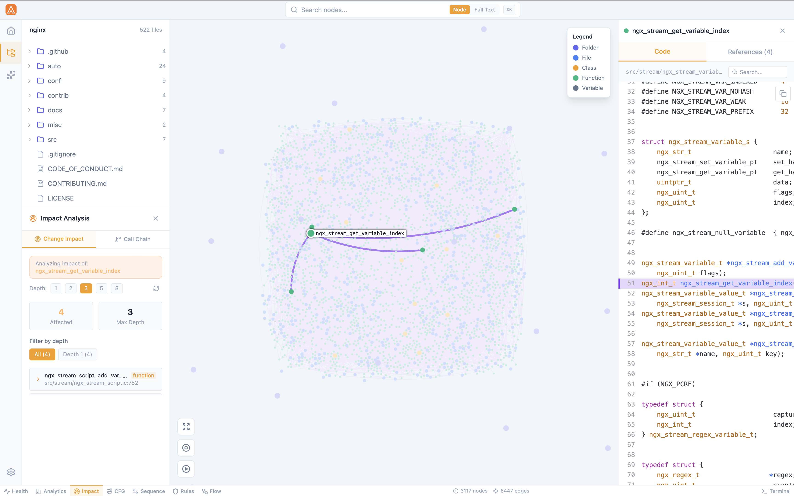

> Click "Impact" in the bottom toolbar to enter the impact analysis panel. The system displays two dimensions: "Change Impact" and "Call Chain". Highlighted paths mark all downstream dependency chains affected from the target node, allowing developers to fully assess the impact scope before modifying code.

**Operation Steps:**

1. Right-click the target node in the graph panel and select "View Impact Analysis"; or manually select the target node in the analysis panel.
2. The system will highlight all direct and indirect code paths that depend on the node.
3. Impact scope is presented in both hierarchical list and graph highlighting forms.
4. Impact analysis reports can be exported for code review or change assessment.

---

### Control Flow Graph

The Control Flow Graph (CFG) graphically displays the execution paths and branch structures within a function.

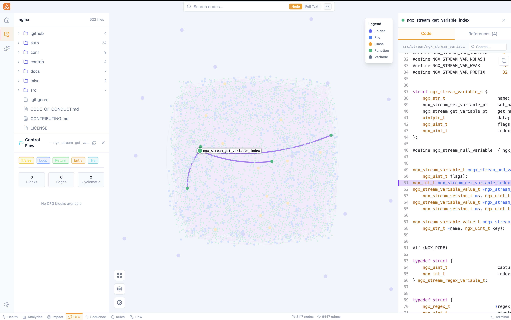

> Click "CFG" in the bottom toolbar to enter the control flow graph panel. The above image shows the control flow graph of the `ngx_stream_get_va...` function, automatically identifying and marking If/Else branches, Loop cycles, and Return statements in the function. The directed graph shows the execution jump paths between code blocks, helping to understand the execution logic of the function.

**Function Description:**

- Automatically parses structures such as conditional branches, loops, and exception handling in functions
- Displays execution jump relationships between code blocks in directed graph form
- Supports highlighting specific execution paths

**Operation Steps:**

1. Select the target function in the code panel or graph panel.
2. Right-click and select "View Control Flow Graph", or switch to the "Control Flow Graph" tab in the analysis panel.
3. In the displayed control flow graph, you can click on each node to view the corresponding code snippet.

---

### Sequence Diagram

The sequence diagram displays the interaction process between modules in the function call chain in chronological order.

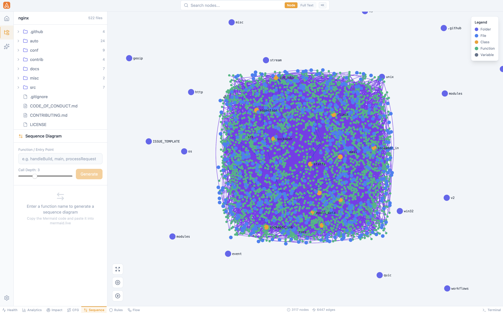

> Click "Sequence" in the bottom toolbar to enter the sequence diagram panel. Fill in the target function name in the "Function / Entry Point" input box (e.g., `handleBuild`, `main`, `processRequest`, etc.), then configure "Call Depth" (calling depth, default is 3), and click "Generate" to generate the UML sequence diagram for the function.

**Function Description:**

- Automatically traces the function call chain and generates standard UML sequence diagrams
- Displays callers, callees, and message transmission order
- Supports multi-level call chain expansion

**Operation Steps:**

1. Select the target function node.
2. Right-click and select "View Sequence Diagram", or switch to the "Sequence Diagram" tab in the analysis panel.
3. View the generated timing interaction diagram, click on each call node to locate the corresponding code.

---

### Architecture Rules

The architecture rules function allows users to customize code architecture constraints and perform compliance checks on the project.

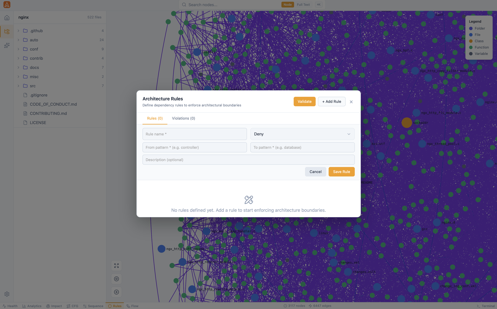

> Click "Rules" in the bottom toolbar to enter the architecture rules panel. Initially, both the Rules (rules) and Violations (violations) lists are empty. Click "+ Add Rule" to start adding architecture constraint rules.

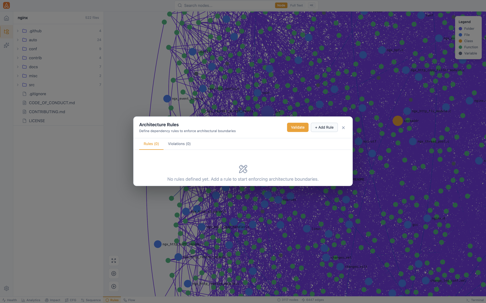

> After adding rules, click the "Validate" button to execute architecture compliance checks. The system will scan the entire code graph according to the defined rules and list all violating dependency relationships in the Violations list, helping teams timely discover architecture degradation issues.

**Function Description:**

- Supports defining prohibited dependency rules between modules (e.g., "UI layer must not directly call DB layer")
- Supports defining mandatory dependency rules (e.g., "All Services must be called via Interface")
- Rules use declarative syntax and support import/export of rule sets
- Check results are displayed in violation list form and can be associated with specific dependency paths in the graph

**Operation Steps:**

1. Open the "Analysis Panel" and switch to the "Architecture Rules" tab.
2. Click "New Rule" or import existing rule set files.
3. Edit rule content and save.
4. Click "Execute Check" to view violation reports.

---

### Execution Flow

The execution flow function is used to trace dynamic call chains during program runtime, assisting in understanding complex execution logic.

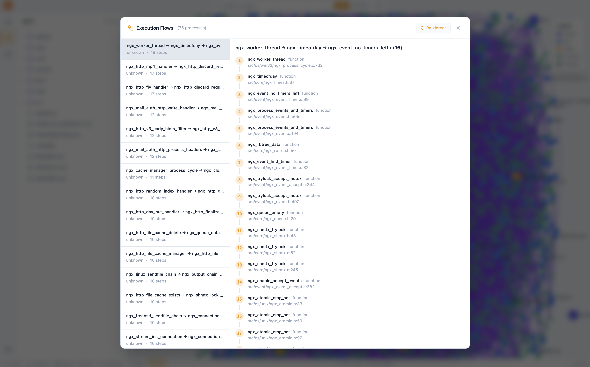

> Click "Flow" in the bottom toolbar to enter the execution flow panel. The above image shows 75 execution flows automatically identified by the system, each presented in the form of "entry function → key call chain → step count". For example: `ngx_worker_thread → ngx_timeofday → ... (19 steps)`, `ngx_http_mp4_handler → ngx_http_discard_re... (17 steps)`. Clicking on a specific flow will highlight the complete execution path in the graph.

**Function Description:**

- Displays complete call paths from entry functions in directed graph form
- Supports setting trace depth to avoid overly complex views due to deep call chains
- Can combine runtime log data for highlighting hot paths

**Operation Steps:**

1. In the analysis panel, switch to the "Execution Flow" tab.
2. Select the entry function as the analysis starting point.
3. Configure trace depth and filtering conditions.
4. Click "Generate Execution Flow" to view the call chain graph.

---

## AI Panel

The AI panel integrates Axons' agent system, providing intelligent Q&A and automated analysis capabilities based on the code graph.

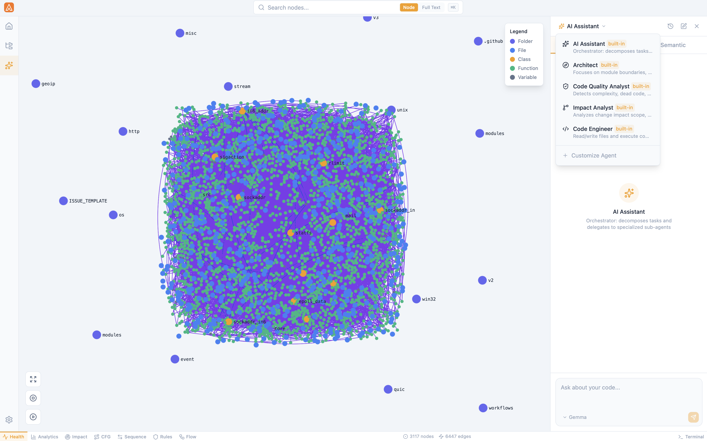

> The above image shows the overall interface of the AI panel. You can switch between different agents (e.g., AI Assistant, Architect, etc.) in the top left corner. The top of the panel provides two interaction modes: "Chat (conversation)" and "Semantic (semantic search)". The bottom toolbar shows currently available analysis functions (Health, Analytics, Impact, CFG, Sequence, Rules, Flow).

---

### Agent Management

The agent management module is used to configure and manage various agents running in the AI panel.

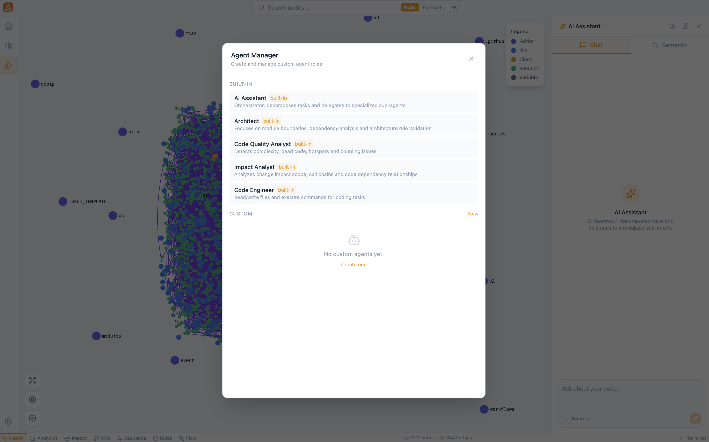

> Click "Agent Manager" in the AI panel to view and manage all agents. The system has built-in the following agents:
> - **AI Assistant (built-in)** — Orchestrator: decomposes tasks and delegates to professional sub-agents
> - **Architect (built-in)** — Focuses on module boundaries, dependency analysis, and architecture rule validation
> - **Code Quality Analyst (built-in)** — Detects complexity, dead code, hotspots, and coupling issues
> - **Impact Analyst (built-in)** — Analyzes change impact scope, call chains, and code dependency relationships
> - **Code Engineer (built-in)** — Reads/writes files and executes commands to complete coding tasks
> 
> In addition to built-in agents, CUSTOM (custom) agents are also supported.

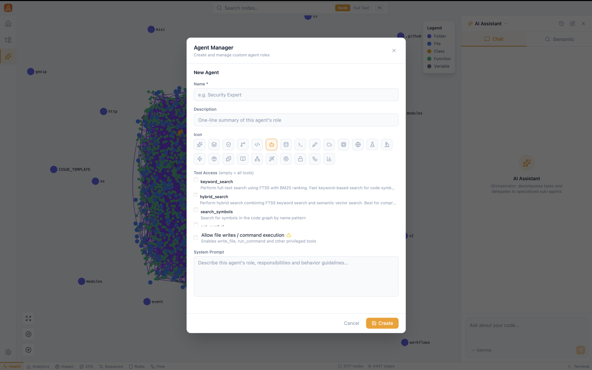

> Click "New Agent" to create a custom agent. Fill in the agent name (e.g., Security Expert) and functional description (a one-sentence summary of the agent's responsibilities), then click confirm to use the custom agent in the AI panel.

**Function Description:**

- View the list of currently available agents and their status
- Enable/disable specific agents
- Configure the working scope of agents (e.g., limit analysis to specific code directories)
- View agent operation logs and execution history

**Built-in Agent Types:**

| Agent | Description |
|-------|-------------|
| AI Assistant | Orchestrator: decomposes tasks and delegates to professional sub-agents |
| Architect | Focuses on module boundaries, dependency analysis, and architecture rule validation |
| Code Quality Analyst | Detects complexity, dead code, hotspots, and coupling issues |
| Impact Analyst | Analyzes change impact scope and call chains |
| Code Engineer | Reads/writes files and executes commands to complete coding tasks |

---

### Conversation History and Session Management

The AI panel retains complete conversation history and supports parallel management of multiple sessions.

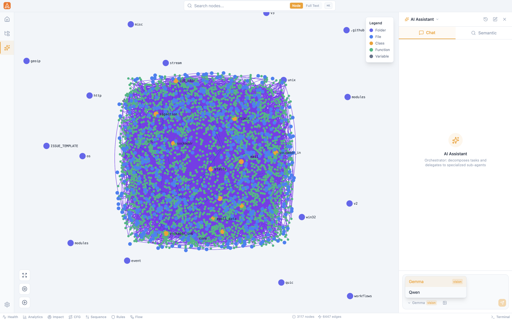

> The above image shows the conversation interface of the AI panel. The AI assistant can link with the code graph, highlighting relevant nodes directly in the graph when answering questions. The left panel provides node search functionality (supporting Node and Full Text modes), and the right AI panel displays conversation history.

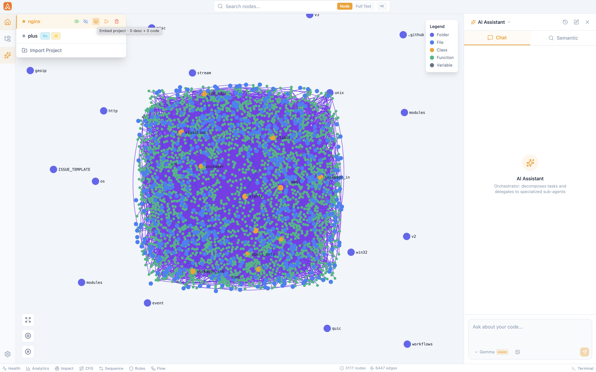

> In multi-project environments, you can quickly switch or add new projects through the "Import Project" entry. The graph panel and AI panel are displayed side by side, and the context of the AI assistant is automatically associated with code elements in the current graph.

#### Architect Agent Conversation Example

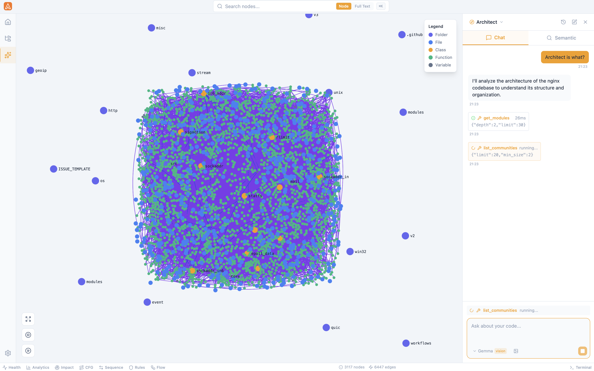

> The above image shows a conversation scenario using the Architect agent for architecture analysis. The user asks "What is Architect?", and the Architect agent responds that it is analyzing the architecture structure and code organization of the nginx code repository, highlighting relevant nodes in the graph.

#### Semantic Search Mode

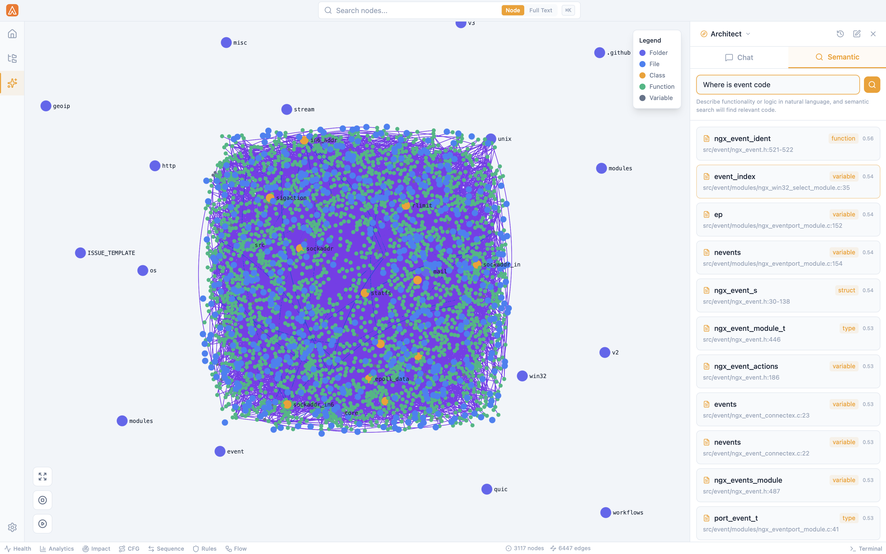

> After switching to "Semantic (semantic search)" mode, you can search for code using natural language descriptions. The system will find code snippets most semantically relevant to the code repository based on vector embedding, rather than just keyword matching, making it very suitable for fuzzy query scenarios like "find code that handles XX logic".

#### AI Analysis Report

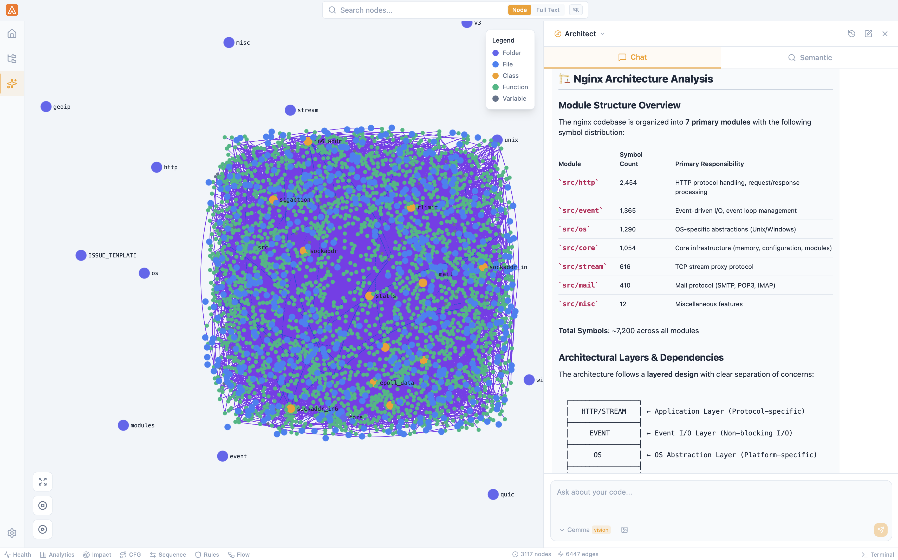

> The above image shows a detailed architecture analysis report generated by the Architect agent. The report is titled "Nginx Architecture Analysis", providing an overview of module structure and symbol distribution statistics for each module, helping developers quickly understand the overall architecture of large projects.

**Function Description:**

- **New Session** — Click "+ New Session" to create an independent conversation context
- **Switch Session** — Click in the left session list to switch
- **Rename Session** — Double-click the session title to rename
- **Delete Session** — Right-click the session item and select "Delete"
- **History Search** — Enter keywords in the search box to quickly search conversation history content
- **Export Session** — Supports exporting conversation records as Markdown or plain text format

**Context Association:**

After selecting code elements in the code panel or graph panel, you can attach them as context to the current session through "Send to AI Panel", allowing the agent to analyze specific code.

---

### Models

The model configuration module is used to manage the large language models used by the AI panel.

**Function Description:**

- View the list of currently configured models
- Add custom models (support OpenAI-compatible interfaces, locally deployed models, etc.)
- Specify different underlying models for different agents
- Configure model parameters (Temperature, maximum Token count, timeout, etc.)

**Steps to Add Model:**

1. Open the "AI Panel" and switch to the "Models" tab (configure in "LLM" in system settings).
2. Click "Add Model".
3. Fill in model name, API address, API Key, and other information.
4. Click "Test Connection" to verify if the configuration is correct.
5. After saving, you can select this model in agent management.

---

## Terminal

Axons has a built-in integrated terminal, supporting direct command-line operations without switching tools.

### General Functions

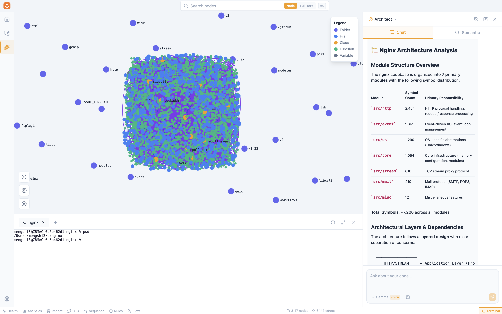

> The above image shows the interface of Axons' built-in terminal in single project mode. The terminal panel is located at the bottom of the interface, with the current working directory being the root directory of the nginx project (`/users/mengshi3/c/nginx`). The graph panel and terminal panel can be displayed simultaneously, allowing developers to execute shell commands without leaving Axons.

**Basic Operations:**

| Operation | Description |
|-----------|-------------|
| Open Terminal | Click the "Terminal" icon in the bottom status bar, or use the shortcut `` Ctrl + ` `` |
| Input Commands | Enter commands after the command prompt and press Enter to execute |
| Clear Terminal | Enter the `clear` command or use the shortcut `Ctrl + L` |
| Copy Content | After selecting terminal text, use `Ctrl + C` (macOS: `Cmd + C`) to copy |
| Paste Content | Use `Ctrl + V` (macOS: `Cmd + V`) to paste |
| Interrupt Command | Use `Ctrl + C` to interrupt currently executing commands |
| Command History | Use arrow keys `↑` / `↓` to browse command history |

**Working Directory:**

The terminal's default working directory is the root directory of the current project, and you can switch using the `cd` command.

---

### Multiple Windows

Axons terminal supports opening multiple terminal windows simultaneously, facilitating parallel execution of different tasks.

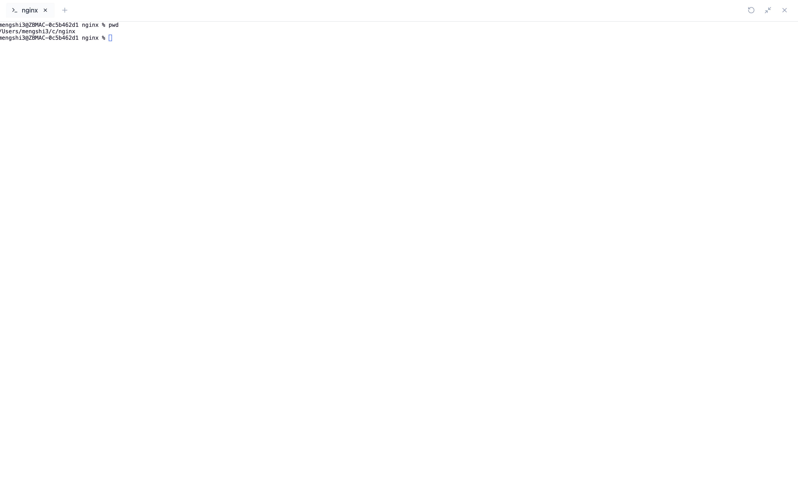

> The above image shows the operation of closing a terminal tab. Each terminal tab has an "×" button on the right side, click to close that terminal session. At the same time, you can see that the terminal panel supports tab management, with the top displaying all currently open terminal tabs.

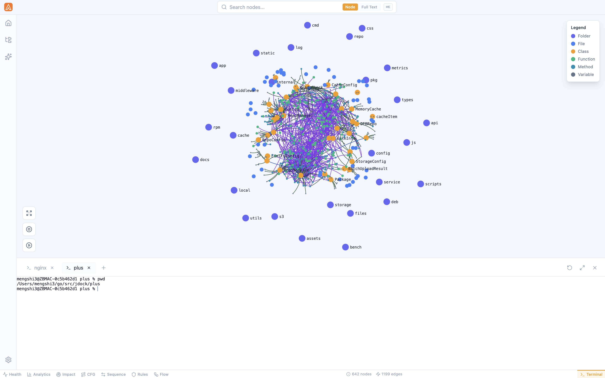

> The above image shows a scenario of using multiple projects and multiple terminals side by side. At this time, two terminal tabs are open (nginx and plus projects), with the plus project terminal currently active, showing the working directory as `/users/mengshi3/go/src/jdock/plus`. The right graph panel synchronously displays the code structure of the plus project.

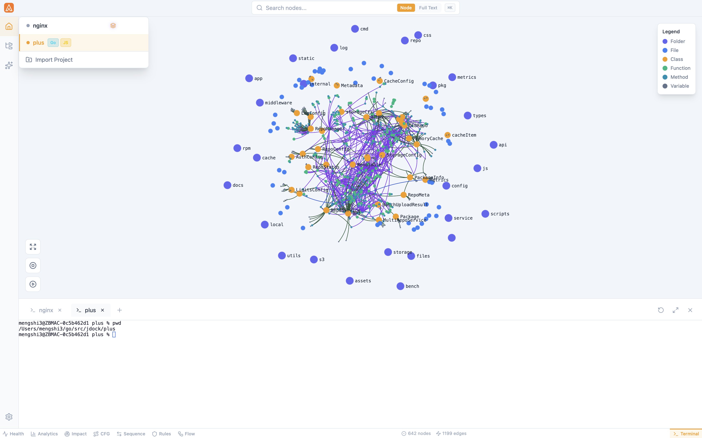

> The above image shows the complete workflow of managing multiple projects simultaneously in Axons. The project list in the top left corner shows that two projects are currently open: nginx and plus. You can quickly add more projects through "Import Project". The bottom terminal panel shows shell sessions corresponding to the projects, and the graph panel synchronously displays the code structure of the currently selected project, enabling seamless switching between projects.

**Operation Instructions:**

| Operation | Description |
|-----------|-------------|
| New Terminal | Click the "+" icon in the top right corner of the terminal panel to create an independent terminal session |
| Switch Terminal | Click the corresponding tab in the terminal tab bar to switch |
| Rename Terminal | Double-click the terminal tab and enter a custom name |
| Close Terminal | Click the "×" icon on the tab, or enter `exit` in the terminal |
| Split Screen Display | Right-click the terminal tab and select "Split Right" or "Split Down" to display multiple terminals side by side |

---

*For more technical details, please refer to [Architecture Documentation](architecture.md) and [API Documentation](api.md).*