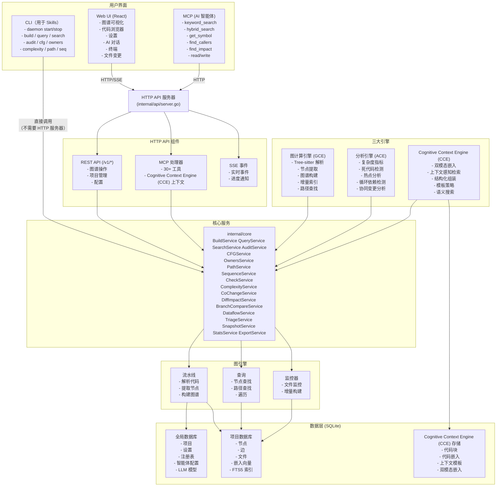
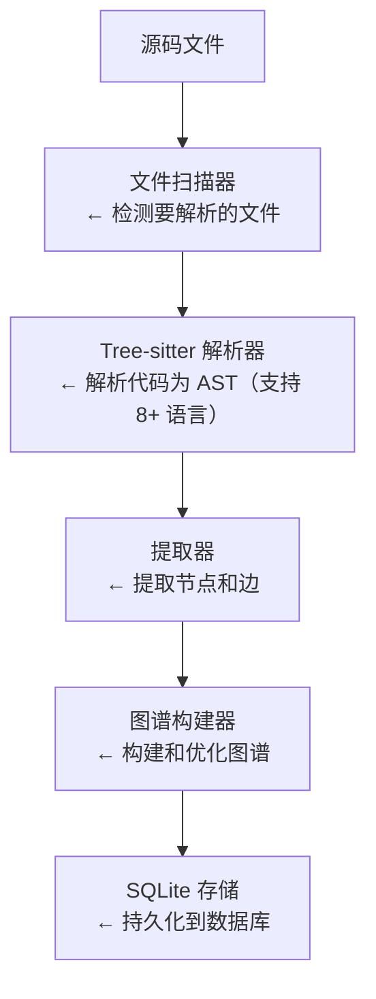
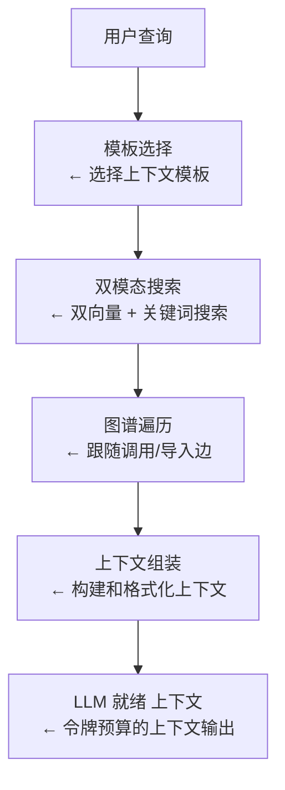
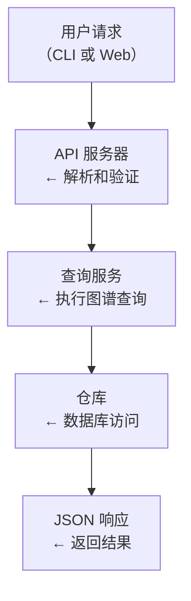

# 架构概览

本文档提供 Axons 架构、其组件以及它们之间交互方式的概览。

## 高层架构

Axons 通过三个引擎（图计算引擎、分析引擎、Cognitive Context Engine (CCE)）驱动多智能体协作，提供从代码理解到智能修复的全链路能力。

三个主要用户界面：
- **CLI** — 命令行界面，直接调用核心服务
- **Web UI** — 基于浏览器的界面，通过 HTTP/WebSocket 通信
- **MCP** — 模型上下文协议接口，通过 HTTP Handler 暴露给 AI 智能体



### 关键架构要点

1. **CLI → 核心服务（直接调用）**：CLI 命令直接实例化并调用核心服务，无需运行 HTTP 服务器。这为本地操作提供了最快的访问方式。

2. **Web UI → HTTP API**：Web 界面需要运行 HTTP 服务器（`daemon start --tcp :8080`），通过 HTTP/SSE 进行图谱可视化、代码浏览、AI 对话、终端访问和设置管理。

3. **MCP → HTTP 处理器**：AI 智能体通过 MCP（模型上下文协议）经由 HTTP Handler 连接，需要运行 HTTP 服务器。这使得 AI 助手可以编程式访问图谱操作、代码搜索、分析工具和文件操作。

4. **共享核心逻辑**：所有三个界面（CLI、Web UI、MCP）使用相同的核心服务（`internal/core`），确保无论通过哪种访问方式，行为都是一致的。

5. **三引擎架构**：GCE 负责代码解析和图谱构建，ACE 提供静态和动态分析，Cognitive Context Engine (CCE) 通过双模态嵌入和检索提供上下文感知的代码理解。

## 核心组件

### 1. CLI 层（`cmd/axons/cmd`）

基于 Cobra 构建的命令行界面。大多数命令**直接调用核心服务**，无需运行守护进程：

**直接执行命令（无需守护进程）：**
- `build` — 构建代码图谱（调用 `core.BuildService`）
- `query` — 查询节点（调用 `core.QueryService`）
- `search` — 搜索代码（调用 `core.SearchService`）
- `audit` — 代码质量审计（调用 `core.AuditService`）
- `cfg` — 控制流图（调用 `core.CFGService`）
- `owners` — 代码所有权（调用 `core.OwnersService`）
- `export` — 导出图谱数据
- `stats` — 获取统计信息
- `complexity` — 分析代码复杂度
- `path` — 查找符号间路径
- `sequence` — 生成调用序列
- `cochange` — 识别协同变更文件
- `dataflow` — 分析数据流
- `diff-impact` — 分析 Diff 影响
- `branch-compare` — 对比分支
- `snapshot` — 创建和管理快照
- `triage` — 问题分类
- `check` — 检查代码健康
- `embed` — 生成向量嵌入
- `registry` — 管理多个项目

**守护进程管理命令：**
- `daemon start` — 启动后台服务（使用 `--tcp` 启用 Web UI）
- `daemon stop` — 停止守护进程
- `daemon ps` — 检查守护进程状态

**注意**：部分命令如 `watch start/stop` 需要运行守护进程，通过 Unix socket 通信。

### 2. UI（`ui/`）

基于 React 的 Web 界面，提供：

- **图谱可视化** — 使用 Sigma.js + graphology 的交互式代码图谱
- **代码浏览器** — 带语法高亮的代码浏览和搜索
- **设置面板** — 配置嵌入提供者、LLM 等
- **AI 对话** — 带流式输出的 AI 代码助手
- **终端** — 基于 xterm.js 的内置终端
- **项目管理** — 管理多个项目
- **文件变更** — 跟踪和管理 AI 文件修改

技术栈：
- React 19 + TypeScript
- Sigma.js + graphology 用于图谱可视化
- xterm.js 用于终端
- Tailwind CSS 用于样式
- Vite 用于打包

### 3. 核心服务（`internal/core`）

CLI 和 HTTP 处理器共享的核心业务逻辑层：

| 服务 | 描述 |
|------|------|
| `BuildService` | 从源码构建代码图谱 |
| `QueryService` | 查询节点和关系 |
| `SearchService` | 搜索代码（关键词/语义/混合） |
| `AuditService` | 代码质量审计 |
| `CFGService` | 控制流图分析 |
| `OwnersService` | 代码所有权分析 |
| `EmbedService` | 嵌入向量生成 |
| `PathService` | 节点间路径查找 |
| `SequenceService` | 调用序列分析 |
| `CheckService` | 代码健康检查 |
| `ComplexityService` | 代码复杂度指标 |
| `CoChangeService` | 协同变更分析 |
| `DiffImpactService` | Diff 影响分析 |
| `BranchCompareService` | 分支对比 |
| `DataflowService` | 数据流分析 |
| `TriageService` | 问题分类 |
| `SnapshotService` | 代码快照 |
| `StatsService` | 项目统计 |
| `ExportService` | 图谱数据导出 |

**使用模式：**
```go
// CLI 直接调用核心服务
repo, _ := openLocalRepo()
svc := core.NewBuildService(repo)
result, _ := svc.Build(ctx, &core.BuildOptions{...})

// HTTP 处理器也调用相同的核心服务
// （或直接使用 graph.Pipeline 进行异步执行）
pipeline := graph.NewPipeline(repo, opts)
result, _ := pipeline.Build(ctx)
```

### 4. HTTP API 服务器（`internal/api`）

处理 Web UI 和 MCP 请求的 HTTP 服务器。HTTP 处理器要么：
1. 调用核心服务（用于同步操作）
2. 直接使用图引擎（用于异步操作如构建）

**REST API 端点：**
- `/v1/build` — 构建图谱
- `/v1/query` — 查询节点
- `/v1/search` — 搜索代码
- `/v1/stats` — 获取统计信息
- `/v1/symbols/:id` — 符号操作
- `/v1/embed` — 嵌入操作
- `/v1/audit`、`/v1/check`、`/v1/complexity` — 分析
- `/v1/cce/*` — Cognitive Context Engine (CCE) 操作
- `/v1/graph/*` — 图算法操作（指标、社区、PageRank、循环检测）
- `/v1/analysis/*` — 分析操作（热点、死代码、协同变更）
- `/v1/arch/*` — 架构规则引擎
- `/v1/processes/*` — 执行流进程
- `/v1/projects/*` — 项目管理
- `/v1/repos/*` — 注册表管理
- `/v1/tasks` — 任务管理
- `/v1/settings` — 设置管理
- `/v1/watch/*` — 文件监控操作

**SSE 事件：**
- `/v1/events` — 实时事件流，用于构建进度和嵌入更新

**MCP 处理器：**
通过 HTTP Handler 为 AI 智能体暴露的 MCP（模型上下文协议）接口：
- **协议**：基于 HTTP 的 JSON-RPC 2.0
- **端点**：`POST /mcp`
- **30+ 工具**，按类别组织：
  - **搜索**：`keyword_search`、`hybrid_search`、`semantic_search`、`rerank_results`、`search_symbols`
  - **图谱**：`get_symbol`、`find_callers`、`find_callees`、`path`
  - **分析**：`list_files`、`get_stats`、`find_dead_code`、`find_hotspots`、`find_impact`、`find_call_chain`、`get_complexity`、`get_cochanges`、`get_pagerank`、`arch_check`、`list_communities`、`get_modules`、`get_node_by_file`、`list_processes`、`get_process`
  - **源码**：`get_source_code`、`embedding_status`、`read_file`、`smart_read`、`write_file`、`run_command`
  - **Cognitive Context Engine (CCE)**：`get_context`、`list_context_templates`

**Web UI 兼容路由**（`/api/*`）：
- 图谱可视化数据
- 文件操作（读/写/删除）
- 搜索和影响分析
- 对话和智能体 API
- 终端会话
- 文件变更跟踪
- LLM 模型管理

### 5. 图引擎（`internal/graph`）

核心图谱处理：

**流水线** — 代码到图谱的转换：
```
源码文件 → Tree-sitter 解析器 → 提取器 → 构建器 → 图谱 (SQLite)
```

**查询服务** — 图谱查询：
- 按名称、ID、文件查找节点
- 关系遍历（调用者、被调用者）
- 路径查找（BFS 最短路径）

**监控器** — 实时文件监控：
- 检测文件变更
- 增量图谱更新
- 基于日志的变更跟踪

### 6. Cognitive Context Engine (CCE)（`internal/cce`）

为 LLM 对话提供智能代码上下文：

**组件：**
- **引擎** — Cognitive Context Engine (CCE) 操作的主要协调器
- **双模态嵌入器** — 生成描述和代码嵌入（双模态）
- **上下文检索器** — 结合语义搜索和图谱遍历的上下文感知检索
- **上下文组装器** — 从多个源组装结构化上下文
- **存储** — 存储代码块、嵌入和模板的 SQLite

**嵌入模式：**
- `description` — 仅元数据文本（传统）
- `code` — 仅源代码片段
- `dual` — 描述和代码都包含（双模态，推荐）

**上下文模板：**
- `understand_function` — 理解函数的上下文
- `change_impact` — 评估变更影响的上下文
- `debug_trace` — 调试/追踪问题的上下文
- `explore_module` — 探索模块的上下文
- `general` — 通用上下文收集

### 7. 智能体服务（`internal/agent`）

用于代码理解的 AI 智能体，具有多智能体编排：

**ReAct 智能体** — 推理和执行智能体：
- 使用 LLM 进行推理
- 执行 MCP 工具
- 维护对话记忆
- 反循环检测和终止条件

**5 个内置智能体配置：**
| 配置 | ID | 描述 |
|------|------|------|
| AI 助手 | `default` | 编排者：分解任务并委托给子智能体 |
| 架构师 | `architect` | 模块边界、依赖分析、架构合规 |
| 代码质量分析师 | `quality` | 复杂度、死代码、热点、耦合检测 |
| 影响分析师 | `impact` | 变更影响范围、调用链、爆炸半径评估 |
| 代码工程师 | `engineer` | 读/写文件、执行命令、完成编码任务 |

**多智能体编排：**
- 主编排者将任务委托给专业子智能体
- `delegate_to_agent` 工具用于智能体间通信
- 通过 API 支持自定义智能体配置

**LLM 客户端：**
- OpenAI（GPT-4 等）
- Anthropic（Claude）
- Ollama（本地模型）
- 自定义端点

**记忆：**
- 基于 SQLite 的对话存储
- 带会话持久性的上下文管理

### 8. 终端服务（`internal/terminal`）

用于 AI 智能体和 Web UI 的内置终端：

**功能：**
- 基于 PTY 的终端会话
- 用于实时 I/O 的 WebSocket 通信
- 会话管理（创建、终止、调整大小、列出）
- 用于回滚的环形缓冲区
- 跨平台支持（Unix 和 Windows）

**API 端点：**
- `POST /api/terminal/sessions` — 创建会话
- `GET /api/terminal/sessions/:id/ws` — WebSocket 连接
- `DELETE /api/terminal/sessions/:id` — 终止会话
- `POST /api/terminal/sessions/:id/resize` — 调整终端大小

### 9. 嵌入服务（`internal/service`）

语义搜索能力：

**搜索服务** — 多模式搜索：
- FTS5 BM25 关键词搜索
- 语义向量相似度搜索
- 混合搜索（FTS5 + 向量 + RRF 融合）
- 重排序支持（Cohere、Jina、模拟）

**嵌入提供者：**
- OpenAI（`text-embedding-3-small/large`）
- Ollama（`nomic-embed-text` 等）
- Jina AI
- 自定义端点

**功能：**
- 增量嵌入更新
- 向量相似度搜索
- 多提供者支持

### 10. 数据库层（`internal/db`）

基于 SQLite 的存储：

**全局数据库：**
- 项目
- 设置
- 注册表
- 智能体配置
- LLM 模型

**项目数据库：**
- 节点（函数、方法、类等）
- 边（关系）
- 文件
- 嵌入向量
- FTS5 全文搜索索引

**Cognitive Context Engine (CCE) 存储：**
- 代码块
- 代码嵌入
- 双模态嵌入
- 上下文模板

### 11. 文件变更跟踪

AI 文件修改跟踪系统：

**功能：**
- 跟踪所有 AI 文件修改
- 查看变更差异
- 回滚单个或所有变更
- 与智能体系统集成，实现安全的代码修改

## 数据流

### 构建图谱



### 上下文检索（Cognitive Context Engine (CCE)）



### 查询图谱



## 节点和边类型

### 节点类型

| 类型 | 描述 |
|------|------|
| `function` | 函数 |
| `method` | 方法（接收者函数） |
| `class` | 类和结构体 |
| `interface` | 接口 |
| `variable` | 变量和常量 |
| `import` | 导入语句 |
| `file` | 源文件 |

### 边类型

| 类型 | 描述 |
|------|------|
| `CALLS` | 函数调用关系 |
| `IMPORTS` | 导入关系 |
| `IMPLEMENTS` | 接口实现 |
| `EXTENDS` | 继承关系 |
| `CONTAINS` | 包含关系 |
| `REFERENCES` | 引用关系 |
| `DATAFLOW` | 数据流关系 |

## 支持的语言

代码图谱引擎通过 tree-sitter 提取器支持以下语言：

| 语言 | 提取器 | 状态 |
|------|--------|------|
| Go | `internal/extractors/go.go` | 生产就绪 |
| TypeScript | `internal/extractors/typescript.go` | 生产就绪 |
| JavaScript | `internal/extractors/javascript.go` | 生产就绪 |
| Python | `internal/extractors/python.go` | 支持 |
| Java | `internal/extractors/java.go` | 支持 |
| Rust | `internal/extractors/rust.go` | 支持 |
| C/C++ | `internal/extractors/c_cpp.go` | 支持 |
| C# | `internal/extractors/csharp.go` | 支持 |

## 扩展点

### 添加新的语言解析器

1. 在 `internal/extractors/<language>.go` 中创建提取器
2. 实现提取接口
3. 在 `internal/extractors/registry.go` 中注册
4. 添加测试数据和单元测试

### 添加新的 LLM 提供者

1. 在 `internal/agent/llm/<provider>.go` 中创建客户端
2. 实现 `Client` 接口
3. 在智能体初始化时注册

### 添加新的嵌入提供者

1. 在 `pkg/clients/embedding/` 中创建嵌入器
2. 实现 `Embedder` 接口
3. 在设置/配置中注册

### 添加新的 MCP 工具

1. 在 `internal/mcp/tools_types.go` 中定义参数类型
2. 在 `internal/mcp/mcp_server.go` 或新文件中实现处理器
3. 在 `registerTools()` 方法中注册工具
4. 在 `internal/agent/profiles.go` 中将工具添加到相关智能体配置

## 部署模式

### 本地开发
```bash
# 启动带 Web UI 的守护进程
axons daemon start --tcp :8080

# 访问 Web UI
open http://localhost:8080
```

### 仅 CLI
```bash
# 构建图谱
axons build /path/to/code

# 查询
axons query main
```

### 生产环境
- 带嵌入式前端的 Docker 容器
- Kubernetes 部署
- systemd 服务

## 性能考虑

- **增量索引** — 只处理变更的文件
- **项目数据库** — 每个项目的隔离存储
- **嵌入缓存** — 代码变更前重用嵌入
- **延迟加载** — 按需加载项目数据库
- **FTS5 索引** — 带 BM25 排名的快速全文搜索
- **双模态嵌入** — 描述 + 代码双向量，实现更好的语义匹配
- **任务管理** — 带取消支持的异步操作跟踪

## 安全考虑

- **路径验证** — 防止目录遍历
- **输入清理** — 验证所有输入
- **API 密钥** — 存储在数据库中，而非环境变量
- **仅本地** — 默认绑定到 localhost
- **终端安全** — `run_command` MCP 工具的命令白名单
- **文件写入范围** — MCP `write_file` 限制在项目根目录
- **变更跟踪** — 所有 AI 文件修改都经过跟踪且可回滚