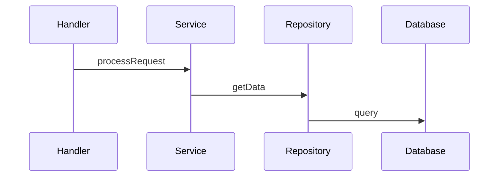

# Dependency Tracker Reference

## Command Reference

### axons query callers
Find all functions that call a given symbol.

```bash
axons query callers --name <symbol> [flags]
axons query callers --id <id> [flags]

Flags:
  --json              Output as JSON
  --limit int         Max results (default: 100)
  --depth int         Depth of transitive callers (default: 1)
```

**Output Fields**:
- `name`: Caller function name
- `file`: Source file
- `line`: Line number
- `kind`: Symbol kind (function, method)

### axons query callees
Find all functions called by a given symbol.

```bash
axons query callees --name <symbol> [flags]
axons query callees --id <id> [flags]

Flags:
  --json              Output as JSON
  --limit int         Max results (default: 100)
  --depth int         Depth of transitive callees (default: 1)
```

### axons query impact
Analyze the impact scope of changes to a symbol.

```bash
axons query impact --name <symbol> [flags]
axons query impact --id <id> [flags]

Flags:
  --depth int         BFS depth for upstream callers (default: 3)
  --json              Output as JSON
  --include-indirect  Include indirect callers
```

**Output Fields**:
- `nodes`: All affected symbols
- `depth`: Maximum depth reached
- `paths`: Example call paths

### axons path
Find the shortest path between two symbols.

```bash
axons path --from <symbol> --to <symbol> [flags]

Flags:
  --from string       Source symbol name
  --to string         Target symbol name
  --max-depth int     Maximum BFS depth (default: 6, max: 10)
  --json              Output as JSON
  --output string     Output format: text, mermaid (default: text)
```

### axons sequence
Generate call sequence diagram for a function.

```bash
axons sequence <function> [flags]

Flags:
  --depth int         Sequence depth (default: 5)
  --output string     Output format: text, mermaid (default: text)
```

**Mermaid Example**:


### axons dataflow
Analyze data flow relationships.

```bash
axons dataflow --name <function> [flags]

Flags:
  --json              Output as JSON
```

### axons audit (for cycles)
Detect circular dependencies.

```bash
axons audit --fail-on-cycle [flags]

Flags:
  --json                 Output as JSON
  --fail-on-cycle        Exit code 1 if cycles found
  --max-cycles int       Maximum allowed cycles (default: 0)
```

## Dependency Types

### CALLS
Function A calls function B.
```
Handler.process → Service.validate
```

### IMPORTS
Module A imports module B.
```
api/handler → domain/service
```

### IMPLEMENTS
Class A implements interface B.
```
UserRepository → IRepository
```

### EXTENDS
Class A extends class B.
```
AdminUser → User
```

## Analysis Patterns

### Downstream Dependencies (Callees)
What does this function call?
```bash
axons query callees --name "processOrder" --depth 2
```

### Upstream Dependencies (Callers)
Who calls this function?
```bash
axons query callers --name "Database.connect" --depth 3
```

### Impact Analysis
If I change this function, what breaks?
```bash
axons query impact --name "Config.load" --depth 4
```

### Path Finding
How does A reach B?
```bash
axons path --from "main" --to "Database.query"
```

## Common Use Cases

### Refactoring Preparation
```bash
# Find all callers
axons query callers --name "oldAPI" --depth 3

# Check for cycles
axons audit --json | jq '.cycles[] | select(.nodes[] | contains("oldAPI"))'

# Understand impact
axons query impact --name "oldAPI" --depth 5
```

### Circular Dependency Detection
```bash
# Find all cycles
axons audit --json | jq '.cycles'

# Count cycles
axons audit --json | jq '.cycles | length'

# Find largest cycle
axons audit --json | jq '.cycles | max_by(.nodes | length)'
```

### Module Boundary Analysis
```bash
# Find cross-module calls
axons query callees --name "Service.method" --json | \
  jq '.[] | select(.file | startswith("domain/")) | .name'
```